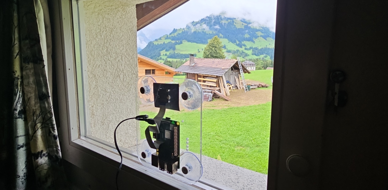

# Plexiglass mount
To install the camera on a window a Plexiglass plane is used with suction cups. On the plexiglass the raspberry W0 or 3B+ is mounted together with the camera. 

*Camera in operation.*

The design has holes for:
 - Raspberry Pi W0 and 3B+
 - raspicam 
 - 4 Suction cups
 - fixing power cable to raspberry with a tirap

*Example suction cups* 
### Design
The design was made with Sketchup 2008 and cut with a laser. The design is availabale in various formats.

*Glass design* 

  
## License
This design free: You can redistribute it and/or modify it under the terms of a Creative Commons Attribution-NonCommercial 4.0 International License (http://creativecommons.org/licenses/by-nc/4.0/) by PE1MEW (http://pe1mew.nl) E-mail: pe1mew@pe1mew.nl

 This work is licensed under a <a rel="license" href="http://creativecommons.org/licenses/by-nc/4.0/">Creative Commons Attribution-NonCommercial 4.0 International License</a>.
## Disclaimer
This design is distributed in the hope that it will be useful, but WITHOUT ANY WARRANTY; without even the implied warranty of MERCHANTABILITY or FITNESS FOR A PARTICULAR PURPOSE.
