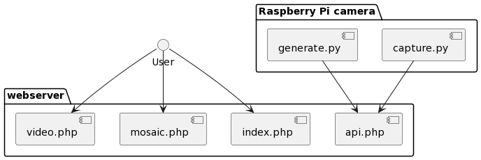

# Code for a simple webcam using a RaspberryPi and a camera.

This howto is work in progress. 




# Installation

## Raspberry

### Disable red led on camera.

Edit config.txt and reboot the device. Camera LED is disabled for good but can be blinked though via GPIO. 
More information see: https://raspberry-valley.azurewebsites.net/Disable-Camera-LED/

Edit the configuration file
```
sudo nano /boot/config.txt
```
Add the following line to config.txt (it helps to add a comment section if you wish)
```
disable_camera_led=1
```
save changes and reboot
```
sudo reboot
```

## Webserver

### Disclaimer
This Python code is distributed in the hope that it will be useful, but WITHOUT ANY WARRANTY; without even the implied warranty of MERCHANTABILITY or FITNESS FOR A PARTICULAR PURPOSE.
  
### License
This Python code is free software: You can redistribute it and/or modify it under the terms of a Creative Commons Attribution-NonCommercial 4.0 International License (http://creativecommons.org/licenses/by-nc/4.0/) by PE1MEW (http://pe1mew.nl) E-mail: pe1mew@pe1mew.nl

<a rel="license" href="http://creativecommons.org/licenses/by-nc/4.0/"></a><br />This work is licensed under a <a rel="license" href="http://creativecommons.org/licenses/by-nc/4.0/">Creative Commons Attribution-NonCommercial 4.0 International License</a>.
